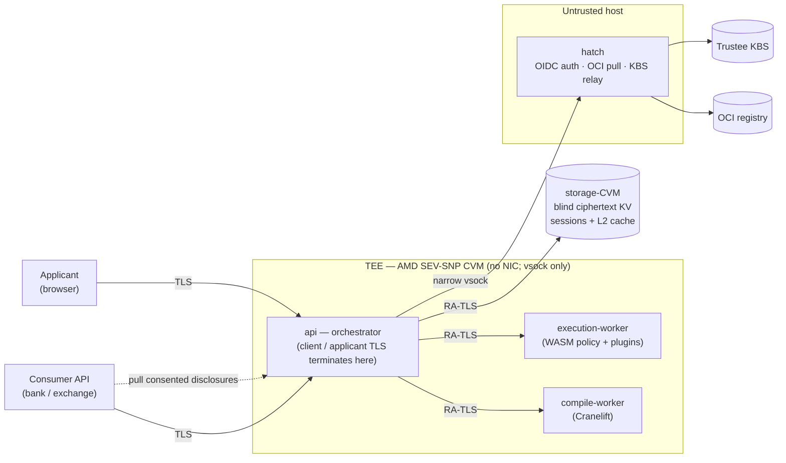

# Enclavid

**A privacy-preserving identity / KYC verification engine that runs the
verifier's own policy inside a TEE — designed so the operator can learn neither
*who* is being verified nor *what* is being checked.**

Identity and KYC verification normally means handing a person's documents and
biometrics to a third party that gets to see all of it. Enclavid inverts that:
the entire verification runs inside a hardware-encrypted Confidential VM (AMD
SEV-SNP), so the party operating the infrastructure sees neither the applicant's
data nor even which checks are being run.

The verifier — a bank, exchange, or other consumer — brings **their own**
verification policy: sandboxed WebAssembly they pin per session. Enclavid pulls
that policy and its verification plugins into the enclave, composes and runs them
there over the applicant's data, and persists none of it. What returns to the
consumer is only a verdict — `approved` / `rejected` / `rejected-retryable` /
`review` — plus whatever the applicant explicitly consented to disclose. Enclavid
the platform stays neutral: it authors no policy, makes no decision, and holds no
data of its own.

Apache-2.0.

## Design goal

- The platform **provably cannot learn who it verifies** — the applicant's
  identity never leaves the enclave in the clear.
- The platform **provably cannot learn what it verifies** — the consumer's
  policy and the applicant's data are pulled encrypted and executed inside the
  attested TEE; the operator sees only ciphertext and an attestation.
- The **applicant controls disclosure** — on a screen they see in full, they
  decide exactly what is revealed to the consumer (*show == seal*: what is shown
  on the consent screen is precisely what the runtime seals to the consumer).
- **Minimal blast radius** — applicant data is encrypted under the applicant's
  own key — held by the applicant, never stored by the platform — and is only
  ever decrypted inside SEV-SNP hardware-encrypted memory; it exists in plaintext
  nowhere else. A breach therefore exposes at most what a single enclave is
  processing at that moment — never data at rest, never past sessions.

These are the properties the architecture is built toward. See
[**Status**](#status) for how far the implementation currently is — most
importantly, attestation still runs on a dev/mock backend, so "provably" is the
design intent, not yet a hardware-rooted guarantee.

## Architecture

Trust boundaries:

- **Client / applicant ↔ TEE** — TLS terminates *inside* the enclave on a sealed
  key; the host can only route opaque bytes.
- **TEE ↔ storage-CVM** — a second attested CVM holds durable session state (and
  a cache of compiled policies) as **encrypted-only data** over an attested
  channel: everything is sealed enclave-side, so the storage-CVM never holds a
  key or plaintext.
- **TEE ↔ untrusted host (`hatch`)** — the enclave has no NIC; all outbound I/O
  goes through a narrow HTTP-over-vsock service on the host (OIDC auth, OCI
  pulls, KBS relay). The host is untrusted on content — every security property
  is enforced TEE-side above the transport.

## Status

Early — the core engine and trust plumbing exist; the KYC pipeline and
production hardening are in progress. Honest snapshot:

**Implemented**

- **Core engine** — runs a consumer's verification policy as sandboxed
  WebAssembly inside the enclave, assembling the policy and its verification
  plugins on demand for each session.
- **Confidential storage** — session data is kept encrypted-only in a separate
  attested store; the host moves opaque bytes and never sees a key or plaintext.
- **Consent & disclosure** — the applicant sees exactly what will be shared and
  approves it; only approved data is released to the consumer.
- **Verification plugins** — ML models (e.g. face detection / age estimation)
  run inside the sandbox.
- **Attested internal channels** — enclave components talk over mutually
  authenticated, attested connections (on a dev/mock attestor for now).
- **Tooling** — a command-line client and a web frontend served from the enclave.

**In progress / not yet**

- **Production TEE hardening** — real SEV-SNP hardware attestation (today mock),
  and a reproducible, measured, encrypted-disk CVM image.
- **The KYC pipeline** — sanctions screening, the standard KYC policy, and the
  remaining checks (liveness, face match, document OCR).
- **Webhooks** — notifying the consumer of status changes and ready disclosures.
- **Sharing media** through the consent flow — the plumbing exists; the share
  path does not yet.

## License

[Apache-2.0](LICENSE).
