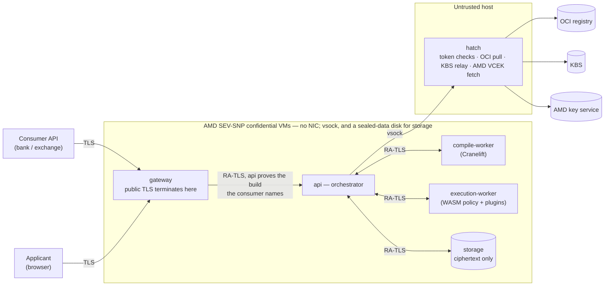

# Enclavid

**A privacy-preserving identity / KYC verification engine that runs the
verifier's own policy inside a TEE — designed so the operator can learn neither
*who* is being verified nor *what* is being checked.**

Identity and KYC verification normally means handing a person's documents and
biometrics to a third party that gets to see all of it. Enclavid inverts that:
the entire verification runs inside hardware-encrypted Confidential VMs (AMD
SEV-SNP), so the party operating the infrastructure sees neither the applicant's
data nor even which checks are being run.

The verifier — a bank, exchange, or other consumer — brings **their own**
verification policy: sandboxed WebAssembly they pin per session. Enclavid pulls
that policy and its verification plugins into the enclave, composes and runs them
there over the applicant's data, and persists none of it. What returns to the
consumer is only a verdict — `approved` / `rejected` / `rejected-retryable` /
`review` — plus whatever the applicant explicitly consented to disclose. Enclavid
the platform stays neutral: it authors no policy, makes no decision, and holds no
data of its own.

Apache-2.0.

## Design goal

- The platform **provably cannot learn who it verifies** — the applicant's
  identity never leaves the enclave in the clear.
- The platform **cannot learn what it verifies** — the consumer's policy runs
  only inside the attested TEE, over the applicant's data. The host that fetches
  the policy and its plugins sees only ciphertext when they were pushed
  encrypted; a plaintext artifact it can read, and it always sees which artifact
  is pulled.
- The **applicant controls disclosure** — on a screen they see in full, they
  decide exactly what is revealed to the consumer (*show == seal*: what is shown
  on the consent screen is precisely what the runtime seals to the consumer).
- **Minimal blast radius** — applicant data is encrypted under the applicant's
  own key — held by the applicant, never stored by the platform — and is only
  ever decrypted inside SEV-SNP hardware-encrypted memory; it exists in plaintext
  nowhere else. A breach therefore exposes at most what a single enclave is
  processing at that moment — never data at rest, never past sessions.

Every link between Enclavid's own enclaves is attested by AMD SEV-SNP hardware,
and the public gateway's quote can be checked against a measurement rebuilt from
source — see [Verifying the gateway](#verifying-the-gateway). Key release from a
KBS is not yet hardware-attested and release measurements are not yet
published, so "provably" is still partly the design goal — see [Status](#status).

## Architecture

```mermaid
flowchart LR
  consumer["Consumer API<br/>(bank / exchange)"]
  applicant["Applicant<br/>(browser)"]

  subgraph tee["AMD SEV-SNP confidential VMs — no NIC; vsock, and a sealed-data disk for storage"]
    gateway["gateway<br/>public TLS terminates here"]
    api["api — orchestrator"]
    comp["compile-worker<br/>(Cranelift)"]
    exec["execution-worker<br/>(WASM policy + plugins)"]
    storage[("storage<br/>ciphertext only")]
    gateway -->|"RA-TLS, api proves the build<br/>the consumer names"| api
    api <-->|RA-TLS| comp
    api <-->|RA-TLS| exec
    api <-->|RA-TLS| storage
  end

  subgraph host["Untrusted host"]
    hatch["hatch<br/>token checks · OCI pull · KBS relay · AMD VCEK fetch"]
  end

  registry[("OCI registry")]
  kbs[("KBS")]
  kds[("AMD key service")]

  consumer -->|TLS| gateway
  applicant -->|TLS| gateway
  api -->|vsock| hatch
  hatch --> registry
  hatch --> kbs
  hatch --> kds
```

Trust boundaries:

- **Client / applicant ↔ gateway** — public TLS terminates *inside* an attested
  gateway enclave. Its certificate is issued for a key that never leaves it,
  under an ACME account whose key is derived inside it too: the host runs the
  issuer's protocol, but only the gateway signs, and CAA records can pin
  issuance to that one account. Whatever carries the traffic to it — the host,
  or a front in front of the host — sees only TLS ciphertext. The host also
  pushes the gateway its routing table, names and issued certificates, and takes
  none of it on trust: every address must prove the named build at the
  handshake, and only certificates for the gateway's own key are presented.
- **Gateway → api** — the consumer names the api build it requires; the gateway
  checks api's quote and build at the handshake and routes only to it. This leg
  is attested one way: api does not ask the gateway for a quote. Sessions stay
  with the group that created them — the api instances of one build on one chip
  — and links carry the group and the build.
- **api ↔ its workers and storage** — mutually attested RA-TLS: api pins each
  worker's build; the workers accept any attested api. The storage CVM holds
  durable session state (and a cache of compiled policies) as
  **encrypted-only data**: everything is sealed enclave-side, so it never holds
  a key or plaintext.
- **TEE ↔ untrusted host (`hatch`)** — the enclaves have no NIC; all outbound
  I/O goes through an HTTP-over-vsock service on the host (token checks, OCI
  pulls, the KBS relay, VCEK fetches from AMD's key service). The host is
  untrusted on content: artifacts are digest-pinned and checked TEE-side.

## Verifying the gateway

The gateway serves its attestation at `/.well-known/enclavid-attestation` as
`application/vnd.enclavid.attestation+cbor`: a CBOR map with `format`
(`"sev-snp"`), `measurement`, `chip_id` and `quote_blob`, where `quote_blob` is
itself CBOR holding the raw SEV-SNP `report`. Only the signed report counts; the
outer `measurement` and `chip_id` are the sender's claim. Checking it:

1. Fetch the attestation and the certificate from the public name.
2. Fetch the VCEK for the chip and firmware versions the report names from AMD's
   key service, check it up to AMD's root, and check the report's signature
   with it.
3. Check the report's posture — the measurement does not cover it: guest policy
   with debugging and the migration agent both off, VMPL 0, signed by a VCEK,
   and reported and launch TCB at or above the floor in
   `crates/attestation/src/snp.rs`.
4. Compare the report's measurement with the one rebuilt from source, at the
   commit the gateway runs: `nix-build image -A measurements.gateway`
   (`measurements.gateway-debug` for a debug image). It needs an x86_64-linux
   builder, but no keys and no SEV-SNP hardware.
5. Check that the first 32 bytes of `report_data` are
   `SHA-256("\0\0ratls-spki\0" ‖ SPKI)`, where SPKI is the DER
   SubjectPublicKeyInfo of that certificate, and that the other 32 are zero.

Steps 2, 3 and 5 are what `enclavid_attestation::verify_quote_supplied` does,
given the VCEK; a CLI command for the whole check is next on the list.

## Status

**Early alpha.** The trusted runtime works end to end on AMD SEV-SNP hardware,
on one host in a development setup (debug images, consumer token checks off): a
session created with a test client went through capture and consent in a
browser, its disclosure was opened, and the gateway's quote matched a
measurement rebuilt from source. The KYC product on top of it is earlier than
that: the verification plugins are placeholders so far.

### Works today

- **Attested gateway** — terminates public TLS in an enclave, proves the api
  build a consumer names before routing to it, and gets its own publicly trusted
  certificate without its key ever leaving it.
- **Core engine** — runs a consumer's verification policy as sandboxed
  WebAssembly inside the enclave, composing the policy and its verification
  plugins per session; compilation runs in a separate worker.
- **Confidential storage** — session state is kept encrypted-only in a separate
  attested store; the host moves opaque bytes and never sees a key or plaintext.
- **Consent & disclosure** — the applicant sees exactly what will be shared and
  approves it; only approved data is sealed to the consumer.
- **Encrypted artifacts** — policies and plugins may be pushed encrypted; the key
  reaches the enclave inline in session creation, inside TLS that ends in the
  enclave.
- **Measured, reproducible images** — every enclave's launch measurement is
  computed from source. The gateway pins no api build, so an api or worker
  release changes neither its measurement nor its certificate, and it can route
  to an old and a new release at once while refusing new sessions to the one
  being drained.
- **Tooling** — a command-line client for authoring and pushing policies and
  plugins, and a web frontend served from the enclave.

### Not yet

- **The KYC pipeline** — document reading (MRZ / OCR), liveness, face match and
  sanctions screening. Face detection (BlazeFace) and a coarse age estimate
  exist only in a build with their model weights supplied; the default build
  uses placeholders.
- **Hardware-attested key release** — the KBS path is wired, but presents
  placeholder evidence rather than an SEV-SNP report, so a KBS cannot yet limit
  release to the attested enclave.
- **Consumer tooling** — a command that verifies the gateway's attestation, and
  client SDKs.
- **Webhooks** — notifying the consumer of status changes and ready disclosures.
- **Sharing media** through the consent flow — the plumbing exists; the share
  path does not yet.
- **Side-by-side releases in the shipped deployment** — `deploy/` replaces api in
  place on one host.
- **Several gateway hosts behind one public name**, with certificate issuance
  working across them.

## Next: tooling and hardening

### Tooling

- A CLI review, starting with the gateway check above as one command.
- Client SDKs, first in TypeScript and Rust.
- A playground site where anyone can run a session.

### Hardening

- **Host egress** — the hatch's outbound requests, registry pulls and the KBS
  relay alike, restricted to public addresses over HTTPS, re-checked on every
  redirect and token request, with size limits and a fixed request shape for
  the relay, so a consumer cannot steer the host at its own network.
- **Applicant key storage** — derived from a passkey where the browser supports
  it rather than kept in web storage, portable across the applicant's devices,
  and gone once the session ends.
- **Hardware-attested key release** — SEV-SNP evidence on the KBS path.
- **Published measurements** — builds in CI, with every release's measurements
  signed into a public transparency log.

After that: the KYC plugins, sanctions screening, webhooks, and compiling a
session's policy before the applicant arrives.

## License

[Apache-2.0](LICENSE).
